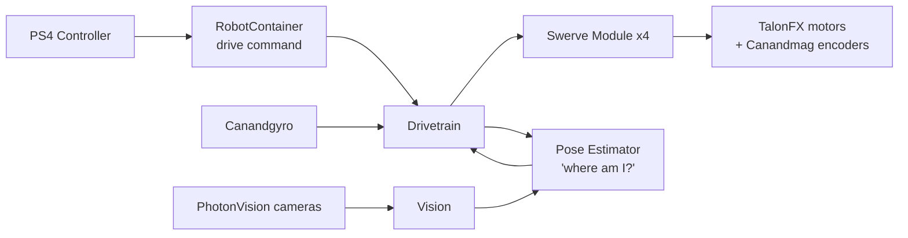

# Student Guide to the 2026 Robot Code

Welcome! This guide explains how our robot's code works: what the big pieces are, how they talk to each other, and why they're built the way they are. You don't need to understand every line of Java to follow it. When you're ready to dig in, each section tells you which file to open.

> **Rules for contributing** (branching, pull requests, competition tags) are in the [README](README.md). Read that before you push anything.

---

## 1. The Big Picture

Our robot is a **swerve drive**: four wheels that can each spin *and* point in any direction on their own. That lets the robot drive sideways, diagonally, or spin while moving, which is great for dodging defenders.

The code does three main jobs, over and over, **50 times per second**:

1. **Sense**: read the motors, the gyro, and the cameras.
2. **Think**: figure out where the robot is and where the driver wants it to go.
3. **Act**: tell each motor what to do.

Each pass through those three steps is called a **loop** (or "tick"). One loop takes 20 milliseconds (`ROBOT_LOOP_PERIOD = 0.02` in `CONSTANTS.java`).



---

## 2. Where the Code Starts

Open `src/main/java/frc/robot/`. The robot starts up in this order:

| File | What it does |
|---|---|
| `Main.java` | The very first thing that runs. It just starts `Robot`. You'll never need to change it. |
| `Robot.java` | The "brain stem." It turns on logging, creates `RobotContainer`, and runs the loop. It also handles switching between modes: **disabled**, **autonomous**, and **teleop**. |
| `RobotContainer.java` | The "wiring diagram." It builds every subsystem, connects controller buttons to actions, and holds the list of autonomous routines. |
| `CONSTANTS.java` | Every number we might want to tune: motor IDs, gear ratios, speeds, PID gains, camera positions. |

**Rule of thumb:** if you're hard-coding a number like `0.5` or `12` in the middle of your code, it probably belongs in `CONSTANTS.java` with a descriptive name.

---

## 3. Command-Based Programming

We use WPILib's **command-based** framework. It has two main ideas:

- **Subsystems** are the *nouns*: physical parts of the robot, like the `Drivetrain` or `Vision`. A subsystem knows how to control its own hardware and nothing else.
- **Commands** are the *verbs*: actions like "drive with the joystick" or "follow this path." A command tells one or more subsystems what to do.

The **CommandScheduler** is the referee. Every loop, it runs each subsystem's `periodic()` method and every active command. It also makes sure two commands never fight over the same subsystem.

In `RobotContainer.java` you'll see two kinds of hookups:

```java
// A button binding: pressing ✕ (cross) resets which way the robot thinks is "forward"
controller.cross().onTrue(new InstantCommand(() -> drivetrain.resetHeading()));

// A default command: what the drivetrain does when nothing else is using it
drivetrain.setDefaultCommand(new RunCommand(() -> { ...read joysticks, drive... }, drivetrain));
```

---

## 4. The Drivetrain (`subsystems/drivetrain/`)

### How driving works, step by step

1. **Read the joysticks.** The left stick is translation (forward/sideways) and the right stick is rotation.
2. **Clean up the input.** A **deadband** ignores tiny stick wiggles near center. The input is also **squared**, which gives the driver fine control at low speeds and full speed at the edges.
3. **Make it field-relative.** Pushing the stick "up" should always move the robot *away from the driver*, no matter which way the robot is facing. `DrivetrainController.fieldToRobotChassisSpeeds()` uses the robot's heading to convert "field directions" into "robot directions." (It also flips 180° when we're on the red alliance, because red drivers stand on the other side of the field.)
4. **Split the motion across four wheels.** `Drivetrain` uses WPILib's `SwerveDriveKinematics` to turn one overall motion (a `ChassisSpeeds`) into a speed and angle for each wheel (a `SwerveModuleState`).
5. **Each module does its part.** `SwerveModule.setModuleState()` has two tricks:
   - **Optimize:** never turn a wheel more than 90°. If you'd have to turn 170°, it's faster to turn 10° and spin the wheel backwards.
   - **Cosine compensation:** if the wheel isn't pointing the right way yet, slow it down so it doesn't push the robot sideways.

### Coordinate system

WPILib uses a standard layout. Memorize it!

- **+X** is **forward**
- **+Y** is **left**
- **Positive rotation** is **counter-clockwise** (looking down from above)

### The hardware

| Part | Brand / model | What it measures or does |
|---|---|---|
| Drive motor (×4) | CTRE **TalonFX** (Kraken/Falcon) | Spins the wheel |
| Steer motor (×4) | CTRE **TalonFX** | Points the wheel |
| Absolute encoder (×4) | Redux **Canandmag** | Knows the wheel angle even right after power-on |
| Gyro | Redux **Canandgyro** | Measures which way the robot is facing |

---

## 5. "Where Am I?": Odometry and Pose Estimation

The robot's **pose** is its position on the field (x, y) plus the direction it's facing. Knowing the pose is essential for autonomous routines and for field-relative driving.

We combine two sources of information:

### Odometry (dead reckoning)
It's like counting your steps with your eyes closed. We measure how far each wheel has rolled and which way it points, add in the gyro heading, and calculate how the robot moved. It's fast and smooth, but small errors add up over time (wheels slip, carpet is bumpy).

To make odometry more accurate, `PhoenixOdometryThread` reads the motors **much faster than 50 times per second** (100–250 Hz, depending on the CAN bus). It runs in the background on its own **thread**, which is like a second worker running alongside the main loop. Because two workers share the same data, `Drivetrain.odometryLock` makes sure they take turns and never read half-updated numbers.

### Vision (AprilTags)
AprilTags are the square black-and-white barcodes placed at known spots around the field. Our cameras run **PhotonVision**. When a camera sees a tag, it can calculate where the robot must be to see the tag that way. Vision is slower and noisier than odometry, but it **doesn't drift**.

`Vision.java` takes each camera's estimate and throws out obviously bad ones (for example, if it says the robot is floating more than 0.5 m in the air). It then hands the rest to the pose estimator.

### Putting them together
`PoseEstimator8736.java` wraps WPILib's `SwerveDrivePoseEstimator`, which uses a **Kalman filter**. That's a fancy way of saying it blends fast-but-drifty odometry with slow-but-accurate vision to get the best of both.

---

## 6. Autonomous (`commands/FollowPath.java`)

During the 20-second autonomous period, the robot drives itself. We plan paths in **Choreo**, a desktop app that creates smooth, time-optimized trajectories. The path files are saved into `src/main/deploy/` so they get copied to the robot.

`FollowPath` is a command that:
1. Starts a timer.
2. Every loop, asks the trajectory: "Where should I be at this exact moment?"
3. Compares that target to the current pose and uses **PID controllers** to correct any error.
4. Sends the resulting speeds to the drivetrain.

It can also **mirror** a path, so one path can be reused for both sides of the field.

Autos are registered by name in `RobotContainer.publishAutoNames()` and picked from a dashboard dropdown ("Auto Chooser") before the match.

---

## 7. Why Every Subsystem Has an "IO" Interface

This is the most important design pattern in the repo, and the one that confuses new members most. Take your time here.

Look in `subsystems/drivetrain/` and you'll see:

```
ModuleIO.java              ← the interface: a "contract" listing what a module can do
ModuleIOTalonFXRedux.java  ← the real hardware version
ModuleIOSim.java           ← the simulated (physics model) version
```

**The analogy:** Think of a video game controller. The game doesn't care whether you're using an Xbox controller, a PlayStation controller, or a keyboard. It just asks, "Is the jump button pressed?" The **interface** is the list of questions the game can ask. Each **implementation** answers those questions for a specific device.

Our `SwerveModule` only ever talks to a `ModuleIO`. It has no idea whether it's controlling real motors or a physics simulation. `RobotContainer` decides which one to plug in:

```java
if (CONSTANTS.CURRENT_MODE == CONSTANTS.SIM_MODE) {
    new ModuleIOSim(...)            // on your laptop
} else {
    new ModuleIOTalonFXRedux(...)   // on the real robot
}
```

**Why bother?**
- You can **test code on your laptop** without a robot.
- We can **swap hardware** (for example, a CTRE gyro vs. a Redux gyro) by changing one line.
- It makes **log replay** possible (see the next section).

### The "Inputs" class and `@AutoLog`

Each IO interface has an inner `Inputs` class holding every sensor reading (position, velocity, current, temperature, and so on). It's marked `@AutoLog`, so when you build, a tool automatically generates a class like `ModuleIOInputsAutoLogged` that logs all of those values for us.

> 💡 If VS Code says `ModuleIOInputsAutoLogged` doesn't exist, **just build the project**. That class is generated during the build.

Every subsystem follows the same pattern in `periodic()`:

```java
io.updateInputs(inputs);                       // 1. read sensors into 'inputs'
Logger.processInputs("Drive/Module FL", inputs); // 2. log them
// 3. make decisions using ONLY the values in 'inputs'
```

---

## 8. Logging and Replay (AdvantageKit + AdvantageScope)

We use **AdvantageKit** to record nearly everything the robot sees and does. Afterwards, we can open the log in **AdvantageScope** to view graphs, a 3D field, and even a 3D model of our robot (from `ascope_assets/`).

The superpower is **replay**. Because every decision is made from logged inputs (step 3 above), we can take a log from a real match, feed those same inputs back into *modified* code on a laptop, and see what the new code *would have* done. It's like re-watching game film, except you get to change the plays.

The robot runs in one of three **modes** (`CONSTANTS.Mode`):

| Mode | When | Hardware used |
|---|---|---|
| `REAL` | On the robot | Real motors and sensors |
| `SIM` | On your laptop | Physics simulation |
| `REPLAY` | On your laptop, analyzing a log | Nothing; inputs come from the log file |

---

## 9. Try It Yourself

You'll need the **WPILib VS Code** installation (from the WPILib website). Open this folder in it, then:

1. **Build:** press `Ctrl+Shift+P` → "WPILib: Build Robot Code" (or run `./gradlew build` in a terminal).
2. **Simulate:** `Ctrl+Shift+P` → "WPILib: Simulate Robot Code" (or `./gradlew simulateJava`). A simulation window will open.
   - In the sim GUI, set the robot to **Teleoperated** and drag a joystick or controller into the Joysticks slot.
   - Open **AdvantageScope**, connect to the simulator, and watch the robot's pose move on the field.
3. **Deploy to the real robot:** connect to the robot's network, then run "WPILib: Deploy Robot Code" (or `./gradlew deploy`). **Ask a mentor first!**

### Starter challenges
- Change `DEADBAND` in `CONSTANTS.DriveConstants` and feel the difference in sim.
- Find where the ✕ button is bound and add a binding for another button.
- `publishAutoNames()` in `RobotContainer` fills in the auto dropdown, but it's never called. Find where it should be called and fix it. (Then make a branch and open a PR!)
- Trace one joystick push all the way to a motor command. Which files and methods does it pass through?

---

## 10. Glossary

| Term | Meaning |
|---|---|
| **AprilTag** | A barcode-like marker on the field that cameras use to find the robot's position |
| **CAN bus** | The wiring network that motors and sensors use to talk to the roboRIO |
| **ChassisSpeeds** | The robot's overall motion: forward speed, sideways speed, and turning speed |
| **Deadband** | A small zone near zero where joystick input is ignored |
| **Encoder** | A sensor that measures rotation (how far or how fast something has turned) |
| **Field-relative** | Directions based on the field ("away from me"), not the robot ("the robot's front") |
| **Gyro** | A sensor that measures the robot's heading (which way it's facing) |
| **Interface** | A Java "contract" that lists methods a class must provide, without saying how |
| **Kinematics** | The math that converts overall robot motion into individual wheel motion (and back) |
| **Odometry** | Estimating position by measuring how far the wheels have moved |
| **PID** | A controller that corrects error: **P**roportional (how far off), **I**ntegral (how long off), **D**erivative (how fast it's changing) |
| **Pose** | The robot's position (x, y) plus heading on the field |
| **roboRIO** | The robot's main computer |
| **Subsystem** | One mechanism of the robot, which owns its own hardware |
| **Thread** | A separate "worker" running code at the same time as the main program |
| **Vendordep** | A library from a hardware company (CTRE, REV, Redux, PhotonVision), stored in `vendordeps/` |

---

## Useful Links

- [WPILib Documentation](https://docs.wpilib.org/): the official FRC programming guide
- [Command-Based Programming](https://docs.wpilib.org/en/stable/docs/software/commandbased/index.html)
- [AdvantageKit Docs](https://docs.advantagekit.org/)
- [AdvantageScope](https://docs.advantagescope.org/)
- [PhotonVision Docs](https://docs.photonvision.org/)
- [Choreo Docs](https://choreo.autos/)
- [CTRE Phoenix 6 Docs](https://v6.docs.ctr-electronics.com/)
- [Redux Robotics Docs](https://docs.reduxrobotics.com/)
